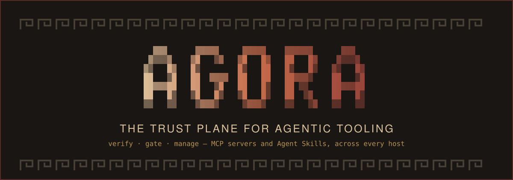
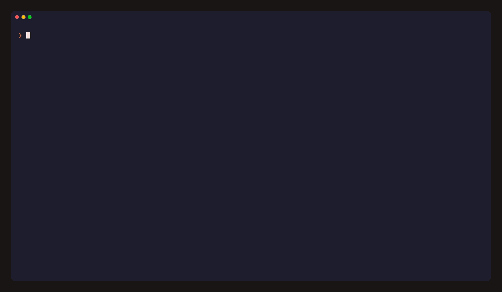

<p align="center">
  
</p>

> **The trust plane for agentic tooling.** Agora verifies where your MCP servers and Agent Skills
> come from, records MCP activity and sampled network peers during use, enforces *your* policy over
> both, and manages them across every host — OpenCode, Claude Code, Cursor, Windsurf.

<p>
  <a href="https://www.npmjs.com/package/agora-hub"></a>
  <a href="https://github.com/IrgenSlj/agora/blob/main/LICENSE"></a>
  <a href="https://github.com/IrgenSlj/agora/actions"></a>
</p>

Registries answer *what exists*. Nobody answers, at the moment you install and run an agent tool, the
only question that matters: **should THIS artifact be trusted, by THIS project, under THIS policy —
and what happens when that answer changes tomorrow?** That is Agora.

Agora is a **customs office over multi-source registries**, not a competing catalog. It deals in
**evidence** — verifiable, inspectable attestations — never opaque numeric "trust scores." It is
host-neutral and local-first: no accounts, no hosted backend you depend on, `--json` on every command.

<p align="center">
  
</p>

<p align="center">
  <sub><em>audit what you already run · search every registry at once · gate what comes in · freeze it into a portable profile</em></sub>
</p>

## Why this exists

The agent-tooling ecosystem has 20k+ published MCP servers and a fast-growing skills ecosystem,
near-zero signing/provenance discipline, a documented 2025–2026 record of supply-chain attacks
(typosquatted servers, rug-pulls, description poisoning, credential exfiltration) — and **no
revocation mechanism at all**. Agora is the layer that verifies provenance, samples observable MCP
and network behavior while you use a server, enforces policy over that evidence, and can revoke —
at the point of install and run. Sampling is evidence, not complete behavior coverage.

## Install

```bash
npx -y agora-hub doctor      # zero-install: audit every MCP server across your hosts
npm i -g agora-hub && agora  # or install once
```

Register `agora` with any MCP client (Claude Code, Cursor, Windsurf, Gemini/Codex CLI, Zed) as an MCP
server — zero-install command `npx -y agora-hub mcp`. From source (requires [bun](https://bun.sh)):
`git clone` · `bun install` · `bun run build` · `bun link`.

## The four planes

Agora is organized as four planes over your agent stack (see [`AGORA_BRIEF_v2.md`](./AGORA_BRIEF_v2.md)
for the full specification):

- **Federate** — one search across multi-source upstream registries (the official MCP Registry as
  canonical, then Glama, GitHub, + skills). Agora never competes on catalog size; its effective
  catalog is everyone's, deduped by [purl](https://github.com/package-url/purl-spec). PulseMCP is
  wired but disabled — it has no self-serve API. Smithery and Hugging Face are non-canonical,
  opt-in research sources.
- **Verify (evidence)** — provenance verification (Sigstore / npm & GitHub attestations),
  schema-and-description hashing with rug-pull **drift** detection, and runtime **observation**:
  `agora run -- <server>` supervises an MCP server while you actually use it and records what it
  advertised and which tools were called, plus sampled network peers. Evidence export uses standard
  **in-toto / DSSE envelopes**, with explicit unknowns; digest resolution and predicate-specific
  schema enforcement are still being completed. See [`docs/EVIDENCE.md`](./docs/EVIDENCE.md).
- **Gate (policy)** — a real policy engine ([Cedar](https://www.cedarpolicy.com/)): your `.cedar` rules
  evaluate evidence per project, alongside a bundled OSV-derived **revocation feed**. Network copies
  are unsigned and additive-only: they may add findings but cannot suppress bundled ones.
- **Manage** — a portable `agora.toml` profile, per-host surgical writes, and an `agora.lock` model
  intended to record exact installed artifacts. Lock verification exists; automatic lock creation
  during acquisition is still being completed. `agora mcp` exposes Agora to agents, but its current
  confirming acquire path is transitional until the request-only human approval boundary lands.

## Status — honestly

Agora is mid-build against the v2.0 brief. The plane descriptions above are the **design**;
[`docs/STATUS.md`](./docs/STATUS.md) is the detailed authority on what the current code proves, and
[`docs/NEXT.md`](./docs/NEXT.md) is the ordered backlog.

| Capability | State |
|---|---|
| **Manage** — stack manager, multi-host adapters, `plan`/`apply`, `sync --from` | ✅ live |
| **Federate** — multi-source, offline-first catalog search (`agora search`) | ✅ live *(4 of 8 sources query by default)* |
| **Verify** — live Sigstore provenance (Fulcio + CT + Rekor, identity-bound) · schema drift · poisoning heuristics | ✅ live |
| **Observe** — `agora observe enable` records MCP activity and sampled direct-process network peers | ✅ live, limited sampling |
| **Gate** — heuristic customs gate **plus** Cedar, provenance, drift, and revocation | 🔄 primary acquire path live; all-write unification pending |
| **Gate** — revocation feed, generated from OSV daily, bundled with the package | ✅ live *(not yet on npm — see below)* |
| **Gate** — `agora audit`: advisories against the servers you actually run | ✅ live *(not yet on npm)* |
| **Lock/export** — digest-bound machine truth and schema-valid portable evidence | 🔄 models/verifier/export exist; acquisition transaction incomplete |
| **Serve** — agent-facing MCP server with policy-filtered discovery | 🔄 intent + approve built; request-only server and consent boundary pending |
| **Sandboxed pre-install `vet`** | ⬜ deferred — replaced by runtime observation above |

> **The last three are on `main`, not on npm.** `agora-hub@0.7.0` is the published version and
> predates them. The next release ships several fronts at once rather than one at a time.

**"Passed the gate" means *no known red flags*, never "safe."** That distinction is deliberate and
appears everywhere a verdict is shown. Agora never fabricates data or counts; if a source is
unreachable, it says so.

## What works today

```bash
agora doctor                     # one table of every MCP server across all your hosts + drift
agora search postgres            # multi-source catalog search across upstream registries
agora acquire mcp-postgres       # resolve → gate → write config (the customs office)
agora plan                       # Terraform-style diff of your stack vs. agora.toml (no writes)
agora apply                      # reconcile host configs to match the profile
agora sync --from <git-url>      # clone someone's whole agent setup — every entry runs the gate
agora integrate --all            # install Agora into every host, using its own stack machinery
agora observe enable             # route every server through the shim; agora observe reports
agora audit                      # advisories against every MCP server you have configured
agora trust mcp-filesystem       # every plane's verdict for one artifact, including the unknowns
agora export --attestations <id> # the evidence as a portable in-toto/DSSE bundle
```

### The one that explains why Agora exists

```console
$ npm audit
found 0 vulnerabilities

$ agora audit
✗ filesystem   HIGH  GHSA-hc55-p739-j48w  path validation bypass
✗ k8s          HIGH  GHSA-gjv4-ghm7-q58q  command injection
✗ playwright   HIGH  GHSA-6fg3-hvw7-2fwq  DNS rebinding
None of these appear in any package.json, which is why `npm audit` reports nothing.
```

Same directory, same machine. `npm audit` is not deficient — **MCP servers are spawned commands in
host configs, not declared dependencies**, so anything that walks a dependency tree cannot see them
by construction. That gap is the product.

Advisories come from [OSV.dev](https://osv.dev) and are refreshed daily by a workflow; nobody
curates a list. The same data fills the revocation feed, which ships *inside* the package — so it
works offline, on first run, with no key to manage.

Turn observation on across every host with `agora observe enable` (`--dry-run` shows the exact
command diff first; `disable` puts every command back). The shim is byte-transparent, and it
records tool *names* and counts plus sampled network peers: never arguments, results, or prompt
text. A missed or unavailable network sample stays unknown.

`agora.toml` is a portable, declarative profile of your whole installation — commit it and anyone
reproduces your setup with `agora sync --from <url>`. Writes are **surgical**: adapters preserve every
unrelated host-config key and write atomically. `agora freeze` writes `env_from` names rather than
host environment values; those names resolve locally during plan/apply and a missing value stops the
write. Do not put credential literals in a hand-authored manifest.

## Upgrading from 0.6.x

0.7.0 is the first release carrying the trust plane, and it removes nineteen commands from the
v1 catalog surface — the accounts, community and curation pillars the
[v2 brief](./AGORA_BRIEF_v2.md) deleted.

Running one of them tells you what happened rather than printing `Unknown command`:

```
$ agora news
`agora news` was removed in v0.7.0.
  The news reader folded into the daily digest.

  Use `agora today` instead.
```

`news`/`trending` → `today` · `use` → `acquire` · `curate` → `search` · `chat` → run `agora` with
no arguments · `workflows` → `search --kind agent-skill`. The account and community commands
(`auth`, `login`, `logout`, `whoami`, `author`, `share`, `save`, `saved`, `bookmarks`, `similar`,
`compare`, `tutorial`, `tutorials`) have **no replacement** — Agora has no accounts and stores no
credentials. `install`, `acquire`, `scan`, `doctor`, `freeze`, `plan`, `apply`, `sync`, `search`
and `browse` are unchanged.

## Positioning

- **A customs office, not a registry.** Agora searches existing registries; it never competes on
  catalog size.
- **Evidence, not scores.** Every verdict is policy evaluated over verifiable attestations — no opaque
  numeric trust score exists anywhere in the product.
- **Host-neutral.** OpenCode, Claude Code, Cursor, and Windsurf are four equal integrations, not one
  identity.
- **Local-first, no accounts.** Every core feature works offline against an on-disk cache — degraded,
  never broken. No auth, no sessions, no hosted backend you depend on.

## Host integration

| Host | Mechanism |
|---|---|
| Any MCP client (Claude Code, Cursor, Windsurf, Gemini/Codex CLI, Zed) | Register `agora mcp` — `npx -y agora-hub mcp` |
| OpenCode | Native plugin (tools **+** hooks) |
| Claude Code | `/plugin marketplace add IrgenSlj/agora` → `/plugin install agora` (tools + `/agora` + skill) |

`agora integrate [host|--all]` installs Agora into each host using its own stack-manager machinery —
the first thing the stack manager manages is Agora itself.

## Development

```bash
bun install
bun run test        # vitest, hermetic (no network)
bun run lint        # biome
bun run typecheck   # tsc
bun run build       # tsc + copy catalog + chmod +x dist/cli.js
bun src/cli.ts <cmd> # run from source, no build needed
```

Node ≥ 22.22.2, ESM only. Direction is locked by
[`AGORA_BRIEF_v2.md`](./AGORA_BRIEF_v2.md); current truth is
[`docs/STATUS.md`](./docs/STATUS.md), the execution plan is [`docs/NEXT.md`](./docs/NEXT.md), and
multi-session handoffs live in [`docs/DEVELOPMENT.md`](./docs/DEVELOPMENT.md). Working non-legacy
features are preserved and improved in place. PRs welcome — see [`CONTRIBUTING.md`](./CONTRIBUTING.md).

## License

[MIT](./LICENSE) — © IrgenSlj.
